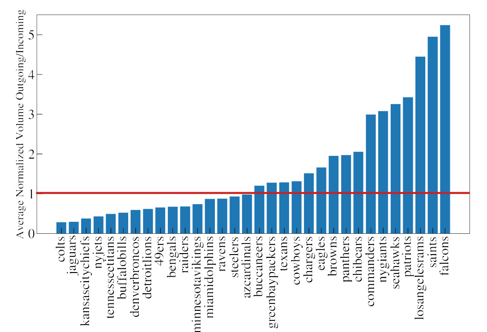
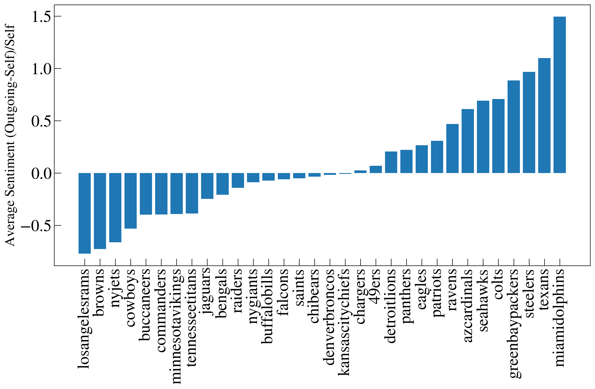
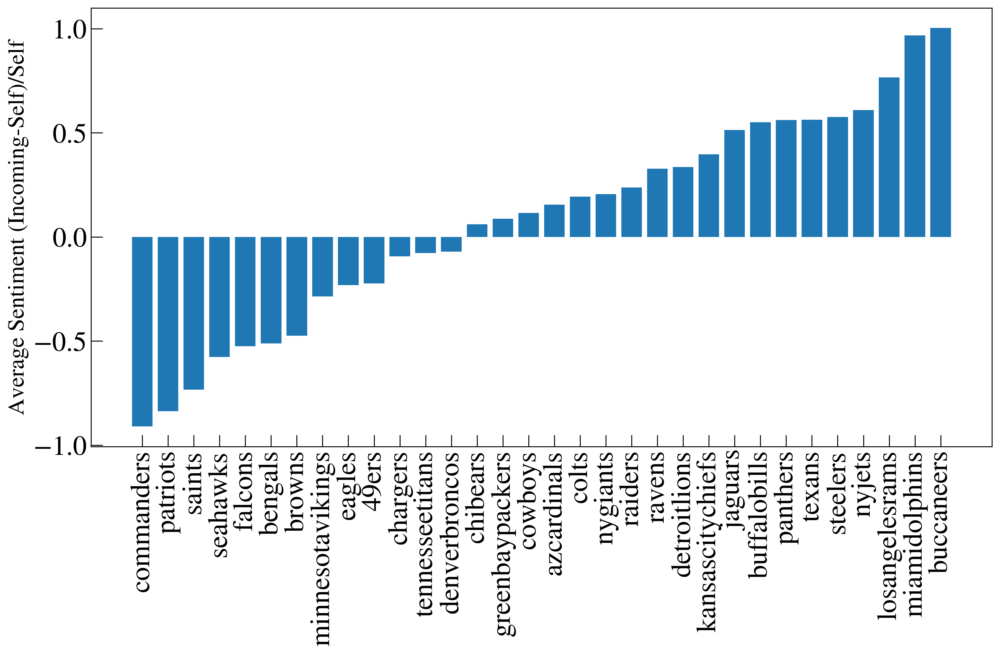
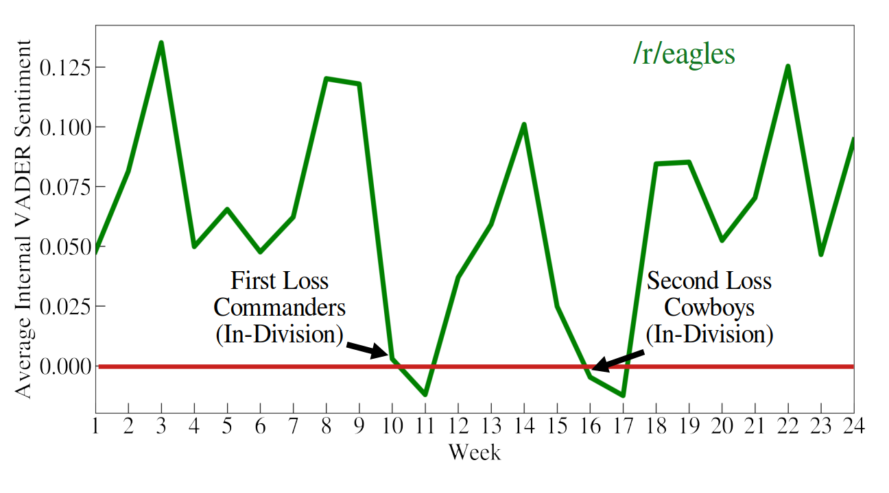
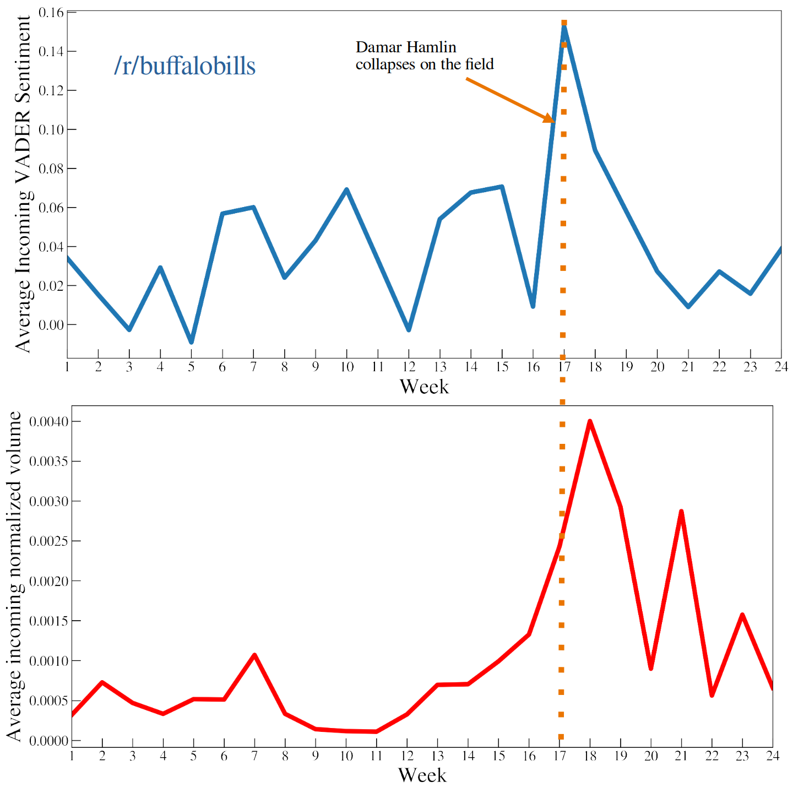

# Commenting Behavior in NFL Team Subreddits
This is a repository for a quick, silly project of mine that started with an open-ended assignment for a graduate course in computational social science at Northwestern University. I was interested in how fans of specific NFL teams comment in their own Reddit communities compared to how they comment in the communities of fans of other teams. I was also interested in analyzing commenting behavior across an NFL season, tying traffic sentiment and distribution to team performance and league-wide events. Because this was a minor side-project only partially for an elective that was mainly focused on data collection, nothing in this repository should be mistaken for rigorous statistical analysis or representative of my professional aptitude. Most of this was written on coffee breaks at an astronomy conference, and I would do it differently if I had the time. I did, however, have a lot of fun, and I hope you enjoy it. Key plots are summarized below, and a more detailed write-up can be found here.

## Inter- and Intra- community sentiment summaries
FIGURE 1: We plot the ratio of outgoing vs. incoming comment volume for each team subreddit. This can be seen as a metric of the amount of engagement of members of one team subreddit in all other team subreddits relative to the engagement of members of all other team subreddits in that subreddit. Members of subreddits above the red line engage with other NFL subreddits more than members of those subreddits do with their subreddit.

FIGURE 2: Here we plot a measure of the sentiment of comments left in other teams' subreddits relative to the internal community sentiment. Members of subreddits to the left tend to comment with more negative sentiment in other teams' subreddits than they do their own, and members of subreddits to the right speak more positively in other teams' subreddits.

FIGURE 3:
Here we plot a measure of the sentiment of comments made in a given team subreddit by members of other team subreddits, relative to the internal community sentiment in the original subreddit. The external community tends to speak with more negative sentiment in subreddits to the left than members of those subreddits, and vice-versa for subreddits on the right.

FIGURE 4:
Average weekly internal sentiment on /r/eagles across the 2022/2023 NFL season and postseason. The red line separates positive and negative VADER sentiment scores. We highlight the weeks coinciding with divisional losses to rival teams.

FIGURE 5:
We plot the average weekly incoming sentiment, and average weekly incoming normalized volume in on /r/buffalobills in the top and bottom panels, respectively. The orange line marks the week in which Bills safety Damar Hamlin suffered a cardiac arrest on the field. 

