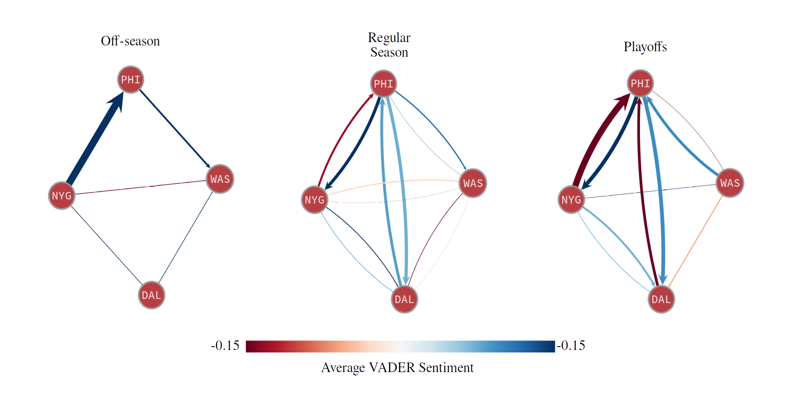
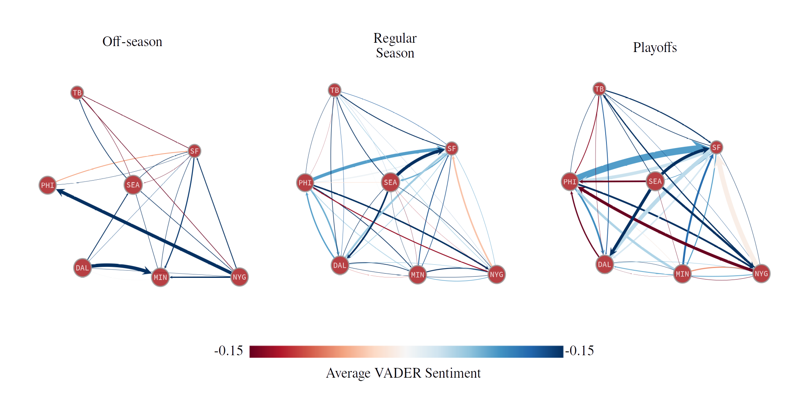

# Commenting Behavior in NFL Team Subreddits
This is a repository for a quick, silly project of mine that started with an open-ended assignment on web-scraping for a graduate course in computational social science at Northwestern University. I was interested in how fans of specific NFL teams comment in their own Reddit communities compared to how they comment in the communities of fans of other teams. I was also interested in analyzing commenting behavior across an NFL season, tying traffic sentiment and distribution to team performance and league-wide events. Because this was a minor side-project only partially for an elective that was mainly focused on data collection, nothing in this repository should be mistaken for statistical analysis or representative of my professional aptitude. No attempt to quantify significance was even considered, and most of this was written on coffee breaks at an astronomy conference. I did, however, have a lot of fun. Key plots are summarized below, and a slightly more detailed write-up can be found [here](./KPHD_project_writeup.pdf).
## Data collection
This analysis was performed on a corpus of ~1.15 million comments across all 32 NFL team subreddits and /r/NFL itself, collected using the PRAW python wrapper for the reddit.com API.

Comments in the general /r/NFL subreddit were leveraged to identify fans who were posting outside of their own team subreddit. While the flairs (self-assigned user tags) on many team subreddits are unrestricted and often inconsistently used, the flairs on /r/NFL are limited to a curated subset of strings, mostly consisting of team names. As such, the dataset is limited to comments by users who also posted to the general /r/NFL subreddit under a flaired username identifying their preferred team.

## Sentiment analysis

Comments were first broken down using the Natural Language Processing Tool-Kit (NLTK), and then passed to VADER for rudimentary sentiment analysis. The VADER model is trained on short-form social media posts including tweets, New York Times editorial snippets, and Amazon product reviews. While the training data isn't sports or reddit-specific, VADER accounts for negation, punctuation, and use of emoticons as well as all-caps as sentiment modifiers, making it a useful first pass at extracting sentiment from reddit comments. VADER's compound scores range between -1 and 1 where --roughly speaking -- scores $<-0.05$ indicate negative sentiment, scores between -0.05 and 0.05 indicate neutral sentiment, and scores $>0.05$ indicate positive sentiment. As examples, the comments  "Our front office is completely incompetent", "Offseason!", and "I’m in such a good mood watching this game I just caught myself laughing at one of Aikman’s jokes." rate a -0.5, 0.0, and 0.79, respectively.

## Inter- and Intra- community sentiment summaries

I first looked at how overall comment volume and sentiment varied across each of the 32 NFL team subreddits. To do this, I distinguished between incoming volume/sentiment (comments in a team subreddit from fans of other teams), outgoing volume/sentiment (comments made by fans of a team in other team subreddits), and internal volume/sentiment (comments made by fans of a team in their own subreddit).

**Figure 1:** Sentiment of comments left in other teams' subreddits relative to the internal community sentiment. Members of subreddits to the left tend to comment with more negative sentiment in other teams' subreddits than they do their own, and members of subreddits to the right speak more positively in other teams' subreddits.

**Figure 2:**
Sentiment of comments made in a given team subreddit by members of other team subreddits, relative to the internal community sentiment in the original subreddit. The external community tends to speak with more negative sentiment in subreddits to the left than members of those subreddits, and vice-versa for subreddits on the right.

## Evolution of comment network throughout the season

Next, I constructed directed, weighted graphs using the graph-tools package to visualize how comment volume and sentiment was redistributed throughout the season. Below, I graph the behavior of users in subreddits for teams in the NFC East, and the subset of NFC teams that made the playoffs, across the 2022 off-season, 2022/2023 regular season, and 2022/2023 playoffs. In general, as we move from the off-season to the regular season to the postseason, incoming normalized volume increases and sentiment intensifies amongst teams that make the playoffs. 

**Figure 3:**
Directed graph of subreddits corresponding to NFC East teams across the off-season, regular season, and playoffs over 2022/2023. Edge thicknesses are weighted by the outgoing normalized volume and colored by the outgoing average sentiment. The Eagles (PHI), Giants (NYG), and Cowboys (DAL) made the playoffs. The Commanders (WAS) did not.

**Figure 4:**
Directed graph of subreddits corresponding to NFC teams that made the playoffs across the off-season, regular season, and playoffs over 2022/2023. Edge thicknesses are weighted by the outgoing normalized volume and colored by the outgoing average sentiment.

## Tracking community sentiment across a season

I then zeroed in on two specific NFL teams to track comment sentiment and volume over the course of the season. Two major stories during the 2022/2023 season were the regular-season dominance of the Philadelphia Eagles (GO BIRDS!!!) until losses to division rivals, and the cardiac arrest of Bills safety Damar Hamlin on the field in a prime-time Monday night game against a rival team. Please note that Hamlin survived and continues to play for the Buffalo Bills. The decision was made to suspend the game due to a medical emergency for the first time in NFL history and the following week saw an outpouring of support from fans and players across the league, including from fans of the opposing team.

These two teams were chosen to see if the events that defined their seasons in the hearts and minds of their fans showed up in the sentiment analysis. No attempt was made to quantify any sort of significance, no correlation was measured, and no causation is claimed. This was mostly an excersize in data collection.

**Figure 5:**
Average weekly internal sentiment on /r/eagles across the 2022/2023 NFL season and postseason. The red line separates positive and negative VADER sentiment scores. We highlight the weeks coinciding with divisional losses to rival teams.

**Figure 6**:
Average weekly incoming sentiment, and average weekly incoming normalized volume on /r/buffalobills in the top and bottom panels, respectively. The orange line marks the week in which Bills safety Damar Hamlin suffered a cardiac arrest on the field.

